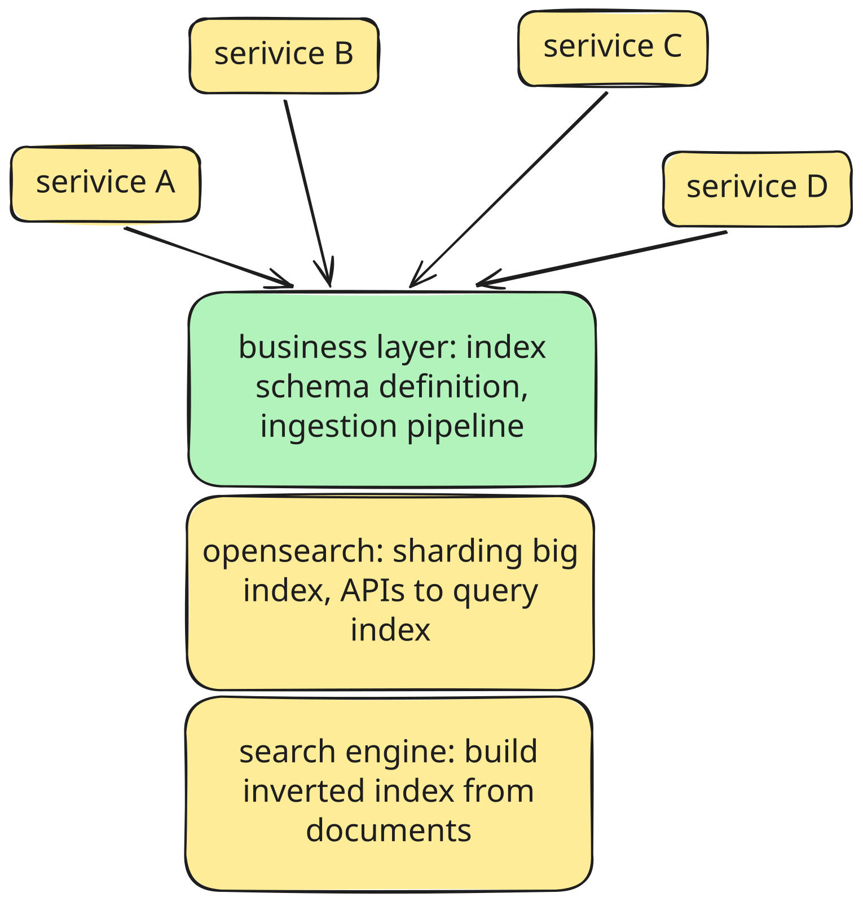
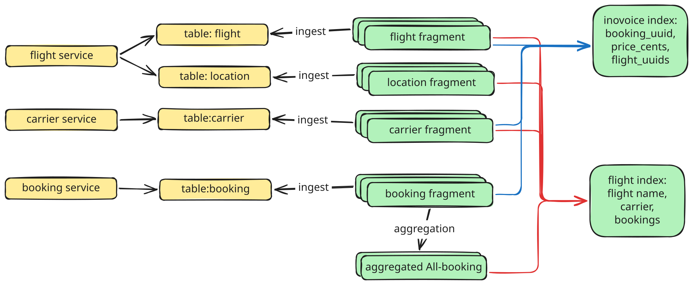
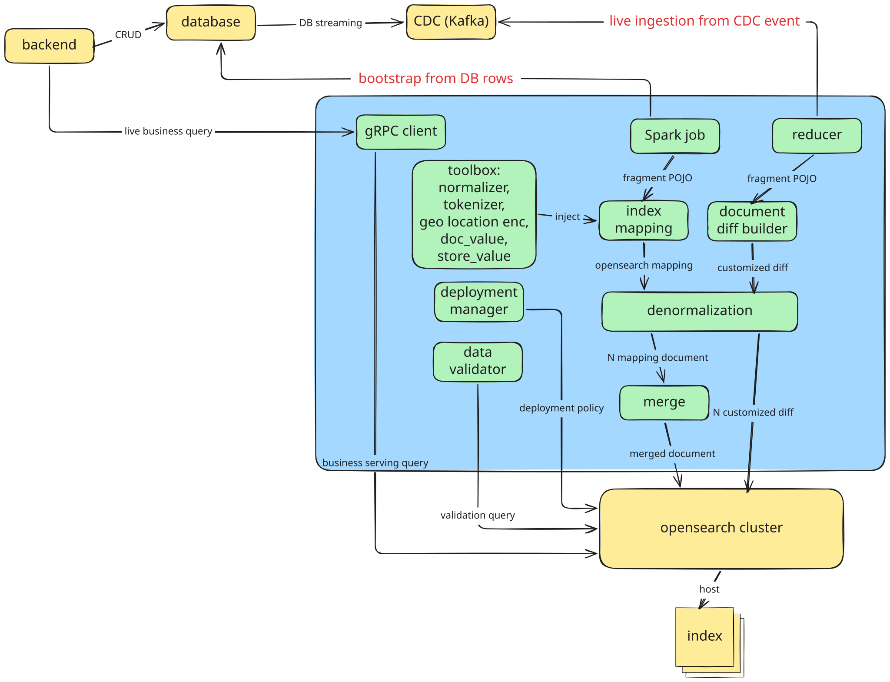

## Introduction 
**Searching** is the process of finding relevant information from a large collection of data based on what a user is looking for. At its core, a search system takes a user’s input—a keyword, phrase, or set of criteria—and returns the items that best match their intent, often ranked by how relevant each result is. This is a frequent recurring problem, for example
 - enterprise search, where users search relevant information from heterogeneous data sources (design doc, Slack, source code, team Wiki).
 - flight booking, where users search the most suitable flight given some hard constraints (landing date) and soft constraints (ticket price).
 - online shopping, where users search by some keyword, and need an ordered list depending on their own needs (latest-update, price from low to high).  

In this article, I will share a generic way to build a search system that is extensible and flexible, and show how this design paid off over the long arc of development.

## Layer of search system



In general, we can think of an end-to-end search as a layered cake
 - layer 0 Apache Lucene: the core search engine. It gives you the most foundational search capability, for example, text analysis, inverted index construction, and relevance-ranked querying. 
 - layer 1 OpenSearch: distributed search and analytics engine. It wraps Lucene and adds everything you need to run search as a service: a REST/JSON API, clustering and sharding across nodes, replication, aggregations.
 - layer 2 search business layer: where we ingest heterogeneous data from various sources, define our search index, deployment strategy, data validation, and power business-specific use cases.
 - layer 3 end-user applications: apps that interact with users, construct search query and return corresponding response.

This article will focus on how to build layer 2, the business layer. Layer 0 and Layer 1 can be taken for granted via OpenSearch adoption, Layer 3 is our upstream that calls our endpoint.  

## Platform Design

We envision the system to be
 - A **centralized infrastructure** for search. All domain-oriented microservices use this search platform, rather than building their own.
 - Able to search **heterogeneous data** coming from different tables and data sources. For example, we want to be able to filter by fields in microservices A and B backed by MySQL, then sort by fields in microservice C backed by Apache Hive. 
 - **Programmatically scalable** to ingest from all data sources. It should be simple for new fields or data sources to be ingested, without requiring complex code.
 - Achieving **near-real-time data freshness** and low-latency querying overhead. This is critical for user experience and daily use cases. Data is regularly updated and these changes should be surfaced in search as quickly as possible. 
 - Clear in **data lineage**. Given we’re working with all sorts of data sources, it’s important to easily trace the source of truth or understand the purpose of any field in search index.
 - Supporting **composable search queries** at query time. Callers should be able to create their own queries against the search index, and not rely on pre-defined queries. This is somewhat inherited from the search engine already.

## Architecture 

There are two core data models, **index** and **fragment**. 


An index represents a searchable entity, and maps to an actual OpenSearch index. Using our flight booking example, a flight is an index, with possible fields like UUID, departure/arrival, promotion, booking, price, airline/carrier, and so on. We can run search queries like, “give me all flights landing in NYC on Sep 3rd”, or “give me all flights from United Airlines that can use this promotion code.”

A fragment represents a data source that’s being ingested. It contains various information like the data source and the fields to be ingested, as well as how they map to the index. For the same example of the flight index, assuming multiple data sources, fields like flight_uuid and created_at are owned by the `flight` service, while bookings are owned by the `booking` service, and promotion is owned by the financial service. Each of these is represented by a fragment.

Given the above, this article introduces a framework that allows an index to be flexibly composed of multiple fragments. It merges these fragments into a single denormalized index that the cluster can serve without joins at query time, with composability of running complex search queries across different data sources. Field ownership is explicit and conflict-free: each field in an index entity comes from exactly one fragment. This also allows us to perform partial index updates easily; the fields changed in a fragment (for example, from a CDC Apache Kafka event) can be directly sent to OpenSearch, without needing to reconstruct the whole document.



The data ingestion pipeline itself is composed of 2 primary steps: **bootstrap** and **live ingestion**, as shown in the above. Bootstrap establishes the initial state of the index, then live ingestion keeps the index fresh. 
During bootstrap, connectors are implemented behind a common interface to pull a full snapshot of each source. This is done through an Apache Spark job, allowing us to read multiple data sources in parallel and ingest data at scale. A data connector can run:
 - Partitioned parallel scans against the database. 
 - Offline Hive warehouse table scans. This avoids some read volume on the live database.
 - A custom implementation like RPC calls to a service.

This setup allows us to easily add various data sources by defining a fragment and specifying the connector to use. The framework does all the heavy lifting, like initiating database connections, running queries in parallel, and feeding database rows into the pipeline. 

Once data is loaded from the source, it’s denormalized and merged, essentially combining all the different fragments for a given UUID into a single document. For example, recall that the flight index has a field called departure/arrival location. Different flights share the same location, meaning we need to propagate location data to all flights referencing this location. All these documents are what make up an index, and are sent off to OpenSearch.

In live ingestion, an Apache Flink streaming job consumes CDC events by setting an offset aligned with the bootstrap timestamp and propagates changes to the affected document within seconds. It performs a similar process to bootstrapping in that it converts the source data into the corresponding fragment, then performs denormalization if necessary. For example, a location change needs to propagate to all flights that use that location. It then updates OpenSearch with these changes. Because ingestion is per fragment, an update rewrites only its piece instead of a full document rebuild, making updates fast and simple.

As can be seen above, both processes end up converting the source data into a fragment. The framework takes care of this conversion by default; this means only the fragment needs to be defined for a data source, and we take care of the rest.
Similarly, our Data Validator is built on the same principles. The fragment defines the connector to use for data validation. The connector implementation will take care of fetching the relevant data and comparing it against the data in search index.

One additional thing to note is that index definition also defines how the field itself is ingested into OpenSearch. This includes things like analyzers to apply, sortability, data type, tokenizers, and so on. This allows us to construct the full OpenSearch mapping for that index, while keeping it in a central place.

## Code example
Up to now, we’ve covered data models like index and fragment, and data pipelines like bootstrap and live ingestion. We also mentioned platform offerings of different tools like the denormalizer. In this section, we use some code examples to show how developers use these concepts via annotations, demonstrating the composability of the platform. All examples are implemented in Java, given that the ingestion pipelines we use (Spark and Flink) are JVM-based.

### Example 1: Index Schema as Code
Every searchable entity is just a Java class with an Index annotation. The code example defines a flight index with 3 fields: name, price, and a geolocation. The AnalyzableField annotation describes how this field is indexed in OpenSearch, in other words, what kind of search this field supports. For example, name is treated as case-insensitive terms, meaning “uNiTED-899” will match “united-899”. At the same time, termOptions doesn’t include PREFIX, meaning “united” won’t match. Also notice that the origin uses GeoField, meaning origin supports all geolocation search, such as all matched flights whose origin is within 10 miles of a city.

```java
@Index
public class Flight {
    @AnalyzableField (type = TERMS, termOptions = {CASE_INSENSITIVE})
    private String name;

    @AnalyzableField (type = NUMERIC, sortable = true)
    private long priceCents;

    @GeoField
    private LatLng origin;
}
```
Later, a generator reflects over these annotations and produces the OpenSearch index mappings automatically. There’s no hand-written schema to keep in lockstep. The Java class is the single source of truth. Also, from the developer’s perspective, they just need to focus on business needs like what query to support on what field. All search internals are hidden behind the annotation implementation.

### Example 2: Compose Index From Fragment 
The index is composed of fragments. A document like a Flight isn’t owned by one team—its data is scattered across many source systems, each owned by a different domain and team. Rather than forcing a single team to own the whole document, the search platform assembles each document from fragments. Every data source contributes one fragment. Teams add new data to an index by dropping in a new fragment class independently, without touching anyone else’s code or coordinating a schema migration. 

```java
@DataSource(
    dbTable = 
        @DBTable(
            cluster = "us-central-1",
            name = "`flight`",
            partition = @DBTable.Partition(numberPartitions = 25),
            hiveTableForBootstrap = 
                @HiveTable(name = "raw_data.org.flight")));
@Fragment (targetIndex = Flight.class)
public class FlightFragment implements FragmentEntity, Validatable {
    @Nullable
    @MappingField(targetField = "priceCents")
    private long bookingPriceWithoutPromotion;
}
```
The flight fragment declares `bookingPriceWithoutPromotion` with the annotation MappingField. This means it ingests the booking_price_without_promotion column from the source table and maps it to the index's `priceCents` field. The DataSource annotation is read by the Spark bootstrapper, which then spins up a partitioned scan on the specified (cluster, table). Here we also introduce an optimization to use an offline Hive table for bootstrap in a production environment to avoid disturbing the critical online store. In a nutshell, fragments extract data from a data source and are used to compose an index.

Fragments are basically just POJOs, and customized getters can also be defined. When also annotated with MappingField, these getters allow us to define custom data transformations.

### Example 3: Creating a Live Ingestion Pipeline From a Single Config
Following the fragment, we come to the final missing piece: config for live ingestion, where the developer specifies the CDC stream as one of the source topics of Flink live ingestion. After adding this config, the worker automatically registers a Kafka consumer on this topic and wires it in as one of the data sources of our Flink job. As a platform, we own and have a centralized view of our Flink job, and can tune operator parallelism, cluster size, and checkpointing accordingly, while as a user, a full pipeline is set just by providing the minimal business-specific setup.

```yaml
- type: Kafka
  dc: us-central-1
  name: Flight # this is the name of our Java class
  topic: kafka-cdc-us_central_1-flight
  cluster: us-central-1-cdc
```

## Use cases
In the following section, we use three examples to demonstrate the flexibility of this design and the benefits of a clear boundary between platform space and user space.

### Declare Once, Derive Everything 

A carrier's DOT number (e.g. AA-AAL, UA-UAL, B6-JBU) is an opaque identifier: upstream services search it by prefix or by a substring anywhere in the middle (b-J). A carrier’s legal name (American Airlines, Delta Air Lines, United Airlines) is plain text, and services expect prefix matching (Amer), case-insensitivity (American = american), and phrase matching (lta ai). These are fundamentally different search contracts, and in search schema, they are declared explicitly on the index field:

```java
// Carrier name - human text contract
@AnalyzableField (
    termOptions = {PREFIX, PHRASE_PREFIX, CASE_INSENSITIVE},
    sortable = true)
private String name;

// DOT number - opaque identifier contract 
@AnalyzableField (
    termOptions = {SUBSTRING, CASE_INSENSITIVE},
    sortable = true)
private String dotNumber;
```
Each term option guides the platform to generate a distinct OpenSearch sub-field with its own analyzer: an edge n-gram tokenizer for prefix matching, a bidirectional n-gram for substring-anywhere, and a lowercase normalizer for case-insensitive exact match. The developer never writes any of this—they declare the contract, and the platform derives the analyzers, sub-fields, and mappings that satisfy it.

The annotation is simultaneously three things: the schema declaration, the analyzer configuration, and the documentation. A developer reading code knows immediately what search behaviors it supports, without tracing through analyzer wiring elsewhere in the codebase. There’s no separate mapping file to keep in lockstep and no place for the declared intent and the actual behavior to drift apart—the Java class defining the index is the single source of truth.

### Declare a Relationship, Get Denormalization For Free
A parent-child hierarchy is a very common pattern in search. For example, changes happening in a carrier impact all its ongoing flights. When a change happens in a parent entity, it must propagate to all of its child entities. Doing this correctly requires knowledge of the relationship between the entities, as well as how to fan-out the changes. But this search design hides all of that behind the `@LinkedEntity` annotation. The developer declares the relationship and implements an ID selector interface; then the platform takes care of the denormalization and propagation. The hard, error-prone part becomes invisible, defining a data relation can be easily declared via one annotation.

```java
// Linked Fragment code
@Fragment(targetIndex = Flight.class)
@LinkedEntity(targetEntity = Flight.Carrier.class)
@Data
public class CarrierFragment implements FragmentEntity, Skippable {
    @Id
    @NotNull
    private String uuid;
}

// Base Fragment code
public class FlightFragment implements FragmentEntity, Validatable {
    @Nullable
    @MappingField(targetField = "Carrier.uuid")
    private String carrierUuid; // so platform can join on flight.carrierUuid = carrier.uuid 
}
```
Continuing our example, we earlier mentioned that the flight and carrier entities come from different data sources, but the flight index contains both flight and carrier details. Here we implement the `CarrierFragment` as a linked entity targeting the `Carrier` sub-field in the flight index, so that the document merger can join carrierUuid in the flight fragment on uuid in the carrier fragment. Everything fits into the normal fragment implementation, but we build another denormalization pipeline by a single line of the LinkedEntity annotation.

### Declare a Fold, Get 1:N Aggregation for free
The previous example covered the many-to-one direction: one carrier change fans out to many flight documents. The one-to-many direction shows up just as often—a flight has many bookings—and it flips the problem: instead of propagating one row into many documents, we need to fold many child rows into a single document.

We model this with an aggregated fragment, split into two classes. The child fragment (BookingFragment) is a normal fragment describing one raw source row, with one addition: a `@ParentId` field declaring which parent it rolls up into. 

```java
@Fragment(targetIndex = Flight.class)
@DataSource(...)
@Data
public class BookingFragment implements BaseFragmentAggregateEntity {
    @ParentId 
    private String flightUuid;

    @Id
    @NotNull
    private String uuid;

    private String seatNumber;
    ...
}
```
The aggregate (`BookingsFragment`) is the folded result: it receives the parent UUID and all of the parent’s child rows, and its constructor is the fold function—sort bookings by seatNumber, count them into numberOfSeatsBooked. Fields marked with `MappingField` are then mapped onto the flight index like any other fragment.

```java
@Fragment(targetIndex = Flight.class)
public class BookingsFragment implements FragmentAggregateEntity<FlightFragment, BookingFragment> {
    @MappingField
    private List<BookingFragment> bookings;

    private String flightUuid;

    @MappingField
    private int numberOfSeatsBooked;

    public BookingsFragment (String flightUuid, Collection<BookingFragment> bookings) {
        this.bookings = bookings.stream().collect(Collectors.toList());
        this.flightUuid = flightUuid;
        this.numberOfSeatsBooked = bookings.size();
    }
}
```
The developer writes exactly one thing: the fold. The platform supplies everything around it, in both pipelines. During bootstrap, the Spark job groups the raw booking rows by `flightUuid` and invokes the fold once per flight. During live ingestion, when a single booking CDC event arrives, the framework looks up which sibling bookings already belong to that flight, fetches just those unchanged siblings from our store, re-runs the same fold over old-plus-new rows, and diffs the result against the current document. So one booking's change updates one element in `BookingsFragment` without rebuilding the rest of the flight, and without ever re-scanning the source table.

## Conclusion 

We introduce a generic way to build the business layer of search system, and the underlying idea is language-agnostic: declare a searchable entity as a business object, and let the platform derive the index, the analysis, and the data pipelines from it. The same pattern maps naturally onto other ecosystems. In Python, decorators and typed field descriptors provide the metadata, and runtime introspection plays the role of reflection. In Rust, attributes (#[search(...)]) carry the metadata and derive macros generate the mapping code at compile time, which strengthens the "code is the single source of truth" guarantee by enforcing it through the compiler. What stays constant across all of these is the principle that matters: a clear boundary between the user’s business definition and the search internals, so the platform can evolve independently of the entities built on top of it.

Essentially, this boundary fell out of two questions: what’s business-specific and should stay with the service, and what’s common and can be abstracted away by the platform. Answering them consistently—across schema definition, analysis, data relations, and engine migration—is what produced a framework that’s extensible to new business use cases, sharable in its common implementations, and flexible enough to swap components independently. The benefit compounds over time: every capability the platform gains is one every entity inherits for free, and every business team’s work stays focused on what’s genuinely theirs.
