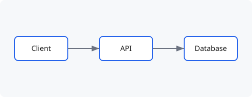

Several topics in mind, this is for myself 

Fundamantal topic
 - Programming language spectrum, Python, Java, Go and Rust
 - What is a DB transaction
 - From request to response, how TCP works 
 - What is a KV cache 
 - Kep ML concepts that need to recite

Learning Notes
 - From Andrew K, how to build a LLM
 - Zero Knowledge Proof 101

Recurring software engineering problems
 - ~~How to design search system (Glean)~~
 - Message Ordering in Distributed System
 - How to design a batch endpoint
 - how to design a workflow orchestration framework (Cadence, Temporal)
 - From SGLang and vLLM, design a performant inference engine
 - How to build a monorepo
 - How to build a ML platform
 - Kubernete deep dive
 - Tokio deep dive
<!-- 
Welcome to the blog. This first post doubles as a cheat sheet for writing new ones.

## Writing a post

Every article is a Markdown file in `src/content/blog/`. The block at the top
(between the `---` lines) is **frontmatter** — metadata about the post:

- `title` — required.
- `description` — optional; shown on the home page and in RSS.
- `pubDate` — required; the publish date, e.g. `2026-08-15`.
- `tags` — optional list, e.g. `[rust, notes]`.
- `draft` — set to `true` to keep a post out of listings while you work on it.

The filename becomes the URL: `hello-world.md` is served at `/blog/hello-world/`.

## Formatting

You get all the usual Markdown: **bold**, *italics*, [links](https://ed25519.io),
lists, blockquotes, and images.

> Blockquotes look like this.

Code blocks are syntax-highlighted:

```js
const keypair = generateKeypair('ed25519');
console.log(keypair.publicKey);
```

## Images and diagrams

Export your diagram from Lucidchart (**File → Download As → SVG**, or PNG),
drop the file in `src/content/blog/images/`, and reference it with a **relative**
path. Astro optimizes anything referenced this way:



```markdown

```

That's it. Add a new file, write, commit, push — it's live. -->
