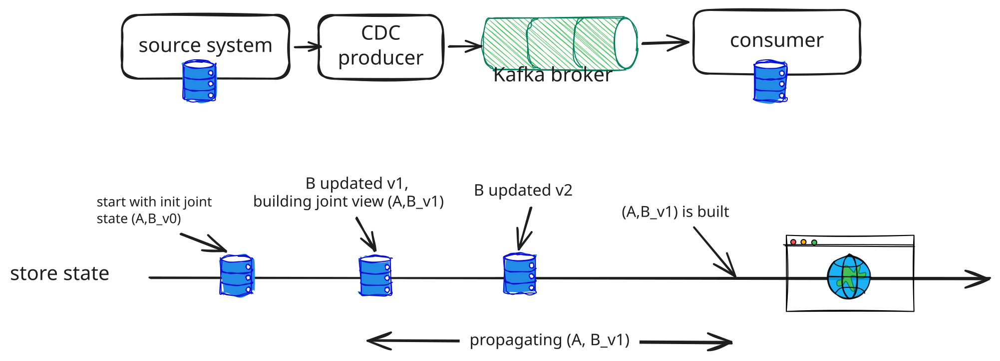

## Introduction 
Building a consistent state downstream is one of the most common pipeline tasks. This problem can be abstracted as the following diagram 

The goal is for the consumer to converge to the same state as the source. 

## How a consumer converges on its source
The first question we ask is, “what makes the consumer not converge?”. Most common discrepancies are a 
 - Producer emits duplicated events for one source change.
 - Consumers process messages in different order than commit order from source, so a stale message is applied as the latest one.
 - It is also possible that the producer's change is not propagated. This can be easily mitigated by the CDC enforcing at-least-once semantics for producers.

Based on that, we design the pipeline to be: 
 - The consumer keeps the latest accepted state per entity together with a mark. A mark is a data structure (_offset, _partition, _cluster, _ts, _epoch, _custom_offset), describing event sequencing from different perspectives. Only events with a higher mark will be applied. This gives eventual consistency between the source system and consumer
 - Anything the consumer emits downstream(a diff or a trigger) is derived by comparing the stored entity (current_state) against the new entity(new proposed state). This builds idempotency at the consumer layer, if its upstream doesn’t have this property. 
 - Every message carries the full state of the entity, instead of a delta. By this design, we don’t have to aggregate a list of historical events to construct the full state of the incoming entity, and the comparison between incoming entities and stored entities is greatly simplified and more robust against disordering/ill-formatting.

The event mark carries the following metadata:
 - _offset: native Kafka offset coming from the broker. It indicates the sequence number within a (_partition, _cluster).
 - _partition: Kafka partition, or a sentinel: -1 means "check disabled”
 - _cluster: the cluster or region of the Kafka broker
 - _ts:  the producer stamp, a commit-ordered token where the source exposes one, otherwise the producer timestamp. Called stamp in the rules below
 - _epoch: a monotonically increasing failover counter for the source, supplied by the failover orchestrator or the WAL timeline.
 - _custom_offset, the customized offset populated by producers, like source field value (version, updated_at).

Once the comparison is defined, applying the same message twice is a no-op, and applying two messages in the wrong order still converges to the newest. The core problem now is about using event marks to decide which event is latest. However, there is no silver bullet in the real production system and “what is the latest” needs combining several options together in a decision tree.

### Ordering options
#### Option1: Kafka partition and offset. 
Every consumed record carries the partition it was read from and the broker-assigned offset within that partition. Kafka guarantees a total order within one partition, and offsets increase monotonically for the life of that partition. If the CDC producer keys each event by the entity's primary key, all events for one entity share a partition and the offset alone orders them. 

However the tuple is only comparable within one (cluster, partition) pair. A partition-count change, a topic rebuild, or replication into another cluster produces offsets that cannot be compared with the old ones, which is why the stored mark also records the cluster and falls back to the producer stamp when the partition or cluster differs.

#### Option 2: producer's stamp. 
When the partition-offset tuple is not comparable, because events for one entity are spread across partitions, replicated across clusters, resized, or backfilled from a snapshot, the consumer has to order by something the producer wrote into the event. That puts the consumer at the mercy of the producer's clock discipline, and skewed stamps are not rare. 

The common MySQL stamp is the Binlog event header timestamp. It has three problems:
 - It is the statement start time, not the commit time. A bulk update that started earlier can commit after a single-row update that started later, so stamp order deviates from commit order.
 - Unix-second cannot differentiate events within the same second
 - Primary failover (and other infra events) can move the clock. If the new primary’s clock runs two seconds behind then every entity updated in the window around the failover gets a post-failover event that looks older than its pre-failover event, and the consumer drops all of them.

Commit-ordered tokens avoid the first problem. MySQL GTID sequence numbers are assigned at binlog flush, so they follow commit order within one source UUID.  But still it is per transaction, so rows updated twice in one transaction still tie, and epoch changes on failover. Use them when the connector exposes them, and keep the epoch in the stored mark too.

#### Option3: customized offset field
Similar to the producer's event timestamp, now we fully rely on the producer to define an offset field. It shares the same vulnerabilities with option 2, but it is extremely useful for backfill and dealing with other infra changes. During such a special period,  option 1 is unavailable and option 2 is unreliable, and we need to define the semantics of ordering right out of the table and let consumers reconstruct a set of entities directly from the source system.

#### Combining all options
Given all options and their limitations, the decision tree can be designed as follows for incoming message m:
  0. No stored mark             -> accept.
  1. m.partition == -1          -> accept. Intentional disable as an operational escape hatch
  2. m.(_cluster, _partition) == s.(_cluster, _partition), both real partitions
                                -> m.offset > s.offset: accept
                                -> m.offset < s.offset: drop
                                -> equal:  duplicated, drop 
  3. Else, both stamp present, stamps are under same token type, compare (epoch, stamp)
                                -> m.(epoch, stamp) > s.(epoch, stamp): accept
                                -> m.(epoch, stamp) < s.(epoch, stamp): drop
                                -> equal: fall through to 4
  4. Else compare custom_offset field  
                                -> greater: or equal accepts
                                -> smaller: drop
                                -> missing on either side: accept, emit metric

Noted this is not a silver bullet but rather an example good for most cases:
 - Rule 3 compares the epoch first to survive failovers. This assumes a monotonically increasing epoch; with an identifier-only epoch, treat a mismatch as not comparable and fall through to rule 4.
 - Rule 4 accepts equal because the backfill's custom offset is created_at, which never changes.
 - A re-insert after a delete must win on rule 3. If it reaches rule 4 it meets the tombstone's MAX and is blocked until the next backfill. 

During Backfill/Bootstrap, the priority is to fully reconstruct a consumer state consistent with the source at one point in time, serving as the initial state for all follow-up ingestion. Hence we define (cluster = NULL, partition = NULL,  epoch = the source epoch at dump time, stamp = the dump's position in the same token type as the live stamp, custom_offset = (if deleted then MAX, otherwise created_at), so deleted record will not resurrect, and live traffic after a backfill routes to rule 3. This will work on both append-only and CRUD DB.

### Timestamp as customized offset 
Although we mentioned using timestamp as the custom offset in bootstrap and backfill, we need to be aware that timestamp may silently introduce some inconsistencies for live ingestion, and thus is only good for bootstrap/backfill
 - tombstones. A delete carries no column change, so a timestamp column cannot order it.
 - Nulls. Timestamps are often nullable. Define a fallback, such as treating NULL as lowest, or there is some undefined behavior.
 - Ties. Some timestamps use a unix second. A second-granularity column cannot correctly identify which is the newest update if multiple transactions happen within the same second.
 - Partial Writes. Bulk fixes, backfills may only update certain columns (an raw UPDATE that skips updated_at) but not touch the column you used.

## Cross-topic dependencies
The above discussion is for single-topic. But what if our consumer needs to build some joint view of multiple topics. For example, an online store wants to build a joined view of the store and its items, with store update and item update in separate topics. Assume A references B, we can build forward/reverse path to maintain the joint view as follows:
 - Forward path (poll based). An A event arrives, the consumer of A reads the current state of B, and builds the joint view.
 - Reverse path(push based). A B event arrives, the consumer of B looks up every A that references B, and rebuilds their joint views.
The consumer keeps the latest state of every A and B in its store, keyed by primary key only, and writes joint views to a serving layer that indexes them by any field. The serving layer becomes consistent after a propagation delay of tens of milliseconds. The reverse lookup has to go through the serving layer, because the store cannot answer "which As reference B".

### Some exceptions
The above forward/reverse path works if we already have an established joint view. However,  there are two complications in building the initial state

#### Case 1: B doesn’t exist yet 
Build A's view with the B fields empty, persist A, record the missing key, and schedule a delayed retry that rebuilds the view once B is present. B's own arrival also repairs it through the reverse path, whichever comes first. Given the retry from A has a budget (usually a couple of minutes), after the budget is exhausted the hole stays until the next event for either side.

You may ask why we schedule a retry from A's side at all, given the reverse path will recompute the joint view anyways. Reverse-path-only has no notion of "how long has this been broken." In cases where B is a dangling reference, like B is deleted, retry from A gives it a bound - after a certain time, we know the joint view cannot be built, log it and potentially trigger an alert.

#### Case 2: Update race
An A event sets a reference to B, and B is updated, within milliseconds of each other on different consumer threads. The reverse path finds A by the link in the served view, and the served view trails the store. Any B event that lands inside that window, for an A whose link was just set or changed, finds no A to rebuild. Co-partitioning A and B onto one thread would remove the race, but many As reference one B, so a B event cannot be routed to every A's partition.

The fix is a hedge from A's side. Whenever an An event sets or changes its link, keep a snapshot of the B state that was merged (B_v1), and schedule a check for a few seconds later, long enough for any racing write to have landed.

The fix is a hedge from A's side. Whenever an A event sets or changes its link, keep a snapshot of the B state that was merged (B_v1), and schedule a check for a few seconds later, long enough for any racing write to have landed.

At retry:
 - Guard. Read the served view of A 
    - The view shows a newer link. Return; the new link's own check covers it.
    - The view already shows B_v2.Return; the reverse path won.
    - The view shows neither, because the forward write has not propagated yet. Reschedule the check once.
    - The view shows B_v1, go to Recompute.
 - Recompute. Build the latest (A, B) by fetching B from the store. In the common no-race case, recompute finds B unchanged and writes nothing. In rare cases, we rebuild the joint view of (A, B_v2) by keeping the latest B.

## Retry queue mechanics
We have a generic retry topic, so one retry queue serves every kind of deferred retry in the job, like dependent events are missing, retry for race update. Each message names the view and the retry type so the consumer can dispatch it. 

Also, remember retry may carry “due time”, the ts of when the retry should be run. However, Kafka has no delayed delivery, and it is an anti-pattern to put thread in sleep in consumer code (Head-of-line blocking, even worse it impacts consumer group liveness). So in consumer, we also need to have a scheduler, so consumers can keep polling without blocking. The scheduler will manage the lifecycle of retry, like popping entries as they come due, dispatching them for actual processing, recovering from retry instance crash. A scheduler is complex enough to deserve its own article.

It is preferable to suppress retries during backfill. Missing dependencies are normal while sibling topics are behind, so nearly every event would spawn a retry and flood the queue. And a retry budget of a couple of minutes cannot outlast a lag of hours. Holes created during catch-up heal as the topics catch up.

## Conclusion
This article introduces an approach to let consumers reliably converge on its source, with a detailed walkthrough of event marks, and their pros and cons. Later, we introduced a cross-topic dependency problem and addressed it with forward and reverse paths, then covered missing dependencies and update races. Last, we mentioned how to build a retry queue and deferred the scheduler to a follow-up article.